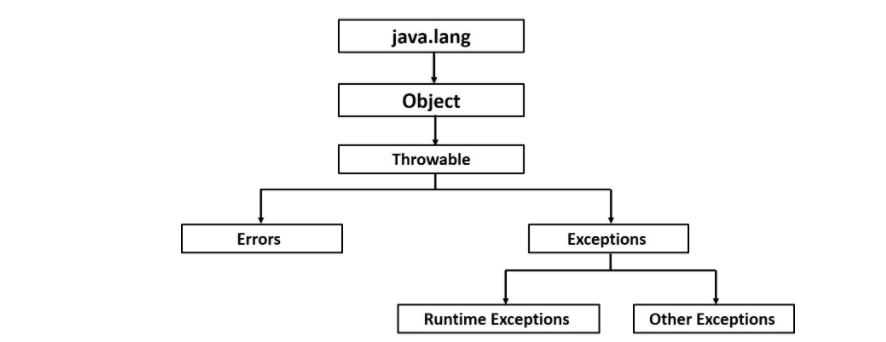

# Exceptions
**A problem that arises during the execution of a program**
- You can handle each type of exception in a different way, and allow your application to continue without crashing
- When problems occur during compilation or execution of a program, exceptions are thrown and can be handled independently
____________________________

**Exceptions come in two forms: checked and unchecked**
## Checked exceptions 
- detected during compilation, and cannot be ignored
- **The compiler enforces that you handle them explicitly**
    - are tested by the compiler, you need to handle these with code or you'll not be able to run your program
- Programmer should take care of (handle) these exceptions

## Unchecked exceptions(Runtime Exceptions)
- ignored at the time of compilation, occur during runtime (at the time of execution)
- **The compiler does not enforce (check) that you handle them explicitly**
    - are not tested by the compiler
- will pop up in the middle of execution

## Errors
- not exceptions at all, but problems that arise beyond the control of the user or the programmer. Errors are typically ignored in your code because you can rarely do anything about an error. For example, if a stack overflow occurs, an error will arise. They are also ignored at the time of compilation.


____________________

## Exception Hierarchy
- exception classes are subtypes of the java.lang.Exception class
- exception class and Error are subclasses of the Throwable class
- Exception is a specific subclass of Throwable and it represents all possible exceptions that may occur within your program


- **Throwable:** is a class that is the parent of all exceptions
- **Error:** is a subclass of Throwable that represents conditions that are typically irrecoverable from
    - an example is the JVM running out of memory
- **Exception:** is also a subclass of Throwable
- **RuntimeException:** is the parent class of unchecked exceptions, this type of exception typically deals with logic errors in your program, such as division by zero or accessing an array index outside of its boundaries
_________________________

### Handling Exceptions
- Use a try/catch/finally block to handle an exception
- **try block:** is used to contain code that can potentially throw an exception
- **catch block:** is used to catch any exceptions that may be thrown from code in the try block. Afterwards, it will execute any code within its block.
    - You can catch multiple exceptions by specifying multiple catch clauses.
    - Order matters when writing multiple catch blocks
    - The least specific Exception class should be placed
          last (because it will catch any subclasses due to polymorphism)
- **finally block:** is used to execute code regardless of if an exception is thrown (even if a return statement is in the try block)
**NOTE: You can also catch RuntimeException or a subclass if you wanted**

### Catching Exceptions
1. try block is placed around the code(protected code) that might generate an exception
2. if an exception occurs the catch block (or blocks) that follows the try is checked
    - in the catch block you declare the type of exception you are trying to catch
    - If the type of exception that occurred is listed in a catch block, the exception is passed to the catch block much as an argument is passed into a method paramete
```
    try{
    //Protected code, code which is prone to exceptions
    }catch(ExceptionName e1){
    //Catch block
    }
```
    - you can handle more than one exceptions using a single catch block 
______________

### Throws/throw 
- **throws** is used to postpone the handling of a checked exception
    - If a method does not handle a checked exception, the method must declare it using the throws keyword
    - appears at the end of a method's signature
    - A method can declare that it throws more than one exception, in which case the exceptions are declared in a list separated by commas

    ```
        public class className{
            public void withdraw(double amount) throws RemoteException, InsufficientFundsException{
                // Method implementation
                throw new RemoteException();
                throw InsufficientFundsException();
            }
            //Remainder of class definition
        }
   ```
- **throw** is used to invoke an exception explicitly
- You can throw an exception, either a newly instantiated one or an exception that you just caught, by using the throw keyword


[Stacktrace](img/stacktrace.png)

#### [Re-throwing Exceptions](img/rethrow.png)
- method does not need to handle a exception at all
- you can re-throw it
- a method declaration can have a throws clause, indicating that it may throw and will not handle certain exceptions
- You can also re-throw an exception instead of using a try/catch block.
- To throw an Exception you'll use the throws keyword on the method that uses code that throws
_________________________________
###### References
- [Java Revature: Exceptions ](https://app.revature.com/core/resources/revContents/content/java/java_exceptions.htm)
- []()
- []()
- []()
- []()
- []()
