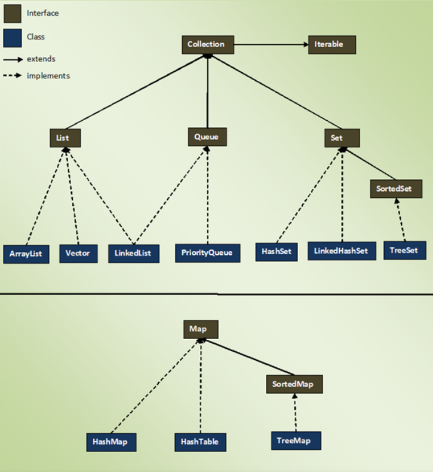

## Collections Framework
- a combination of classes and interfaces, which are used to store and manipulate the data in the form of objects
- predefined architecture of different types of collections
- various classes included such as ArrayList, Vector, Stack, and HashSet, etc.
- various interfaces included such as List, Queue, Set, etc.

_______________________________________

## Collection
- an object that contains and manipulates a group of objects
- Example of a collection:
    - List
    - Set
    - Queue
    - Maps
- List, Set and Queue are some of the interfaces that extend Collection
_____________________________

### Collection
- A **collection** is any group of individual objects which are represented as a single unit is known as the collection of the objects.
### Collection Framework
- The **Collection Framework** is a combination of classes and interfaces, which is used to store and manipulate the data in the form of objects. It provides various classes such as ArrayList, Vector, Stack, and HashSet, etc. and interfaces such as List, Queue, Set, etc. for this purpose.
- Collection framework implements various interfaces
- Collection interface and Map interface (java.util.Map) are the mainly used interfaces of Java Collection Framework, List of interfaces of Collection Framework is given below

- Collection is an interface defined in the java.util package (the interface that most classes implement)
- A collection is an object that acts as a storage system for multiple elements( used to store multiple objects)
- interface implemented by all collections

### Collections
- Collections (notice the 's') is a utility class that provides several static methods useful when working with
a Collection object
- There are several different types of collections, and they are mainly distinguished by two characteristics:how they order elements, and whether those elements are sorted
_____________________
### Types of Collections
#### Ordering
- determines where an element is in a collection
    - A List assigns an index to each element and a Map associates an object with another as a key/value pair

#### Sorting
- determines an element's position based on its value; it can be alphabetical, numerical or other.
    - A SortedSet maintains positions based on a supplied method

________________________________________
### [Collection Hierarchy](img/collectionhierarchy.png)
- List, Set and Queue are interfaces that extend Collection.
- **List:** is an interface that specifies an order 
    - it is not sorted by default
    - zero base, index starts at 0
    - ArrayList and LinkedList are common implementations(they implement List).
    - [ArrayList Example](img/collectionsarraylist.png)
        - ArrayList is a class that implements the List interface and can grow and shrink dynamically unlike Arrays
        - a new ArrayList, list, and instantiated it `ArrayList<String> arrList = new ArrayList();`
            - needs the java.util import statement `import java.util.ArrayList;`
            - the angle brackets denote the data type stored in the ArrayList, (denotes that this is a generic data type being used)

        - 4 strings are added using the add method
        - the value at index 2 is being retrived by the `get() `method
            - the `get()` method is declared in the ArrayList class and is used to return an eke=lement at the specified index or position     
- **Set:** is an interface that specifies a collection that doesn't allow duplicate elements
    - similar to list except all elments are unique and order may not be maintained
    - HashSet and TreeSet are common implementations.
- **Queue:** is a collection that maintains order
    - it is like a List
    - typically it maintains FIFO ordering
    - LinkedList and PriorityQueue are common implementations
    - a Priority Queue maintain order in a manner maintained by the developer

### Common Collection Methods
**The following methods are common amongst all Collection implementations:**
- add(Object o) - adds an element to a collection
- contains(Object o) - returns true if the specified element is in the Collection
- remove(Object o) - removes the indicated object from the Collection
- size() - returns the number of elements within the Collection
**Choosing the Right Container**
- If you need to contain an assortment of items, then a List will suffice.
- If you need to only maintain unique items, then a Set will suffice.
- A Map is great for managing associations between information such as keeping a username associated with an id
- If you need a sorted collection, then TreeSet would be best.
- If speed matters more, then HashSet would be best. 
________________________________________
###### References
- 
- 
- 
- 
- 
- 