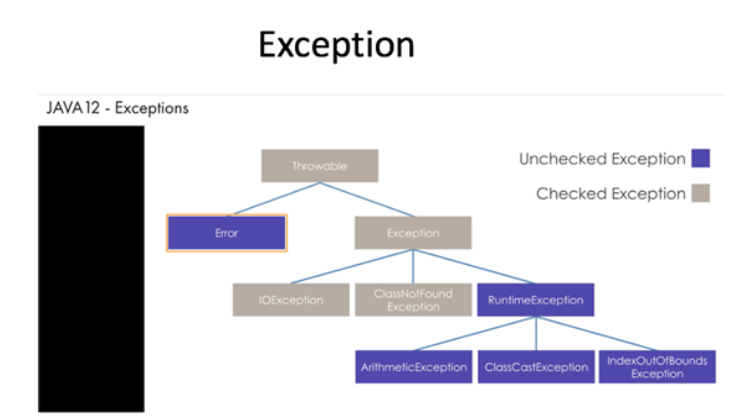

## Exceptions
**When your application encounters problems that stop it from completing its tasks it will “throw” an exception or error.**
- problems that the application can reasonably be expect to recover from
- inherit from Exception
- all exceptions inherit from the class Throwable and will be thrown at runtime
- Come in two major forms:
    - **Checked Exceptions (Compile Time Exceptions):** 
        - are anticipated as possible and so the compiler will require you to handle them in some manner before it will compile.
        - FileNotFoundException
        - Other I/O Exceptions
    - **Unchecked Exceptions (Runtime Exceptions):**
        - compiler does not anticipate these, or require you to preemptively handle them.
        - Generally these are problems in the logic of the code itself that can be avoided instead of requiring handling.
        - NullPointerException
        - ArrayIndexOutBounds
        - RuntimeException is the parent of all unchecked exceptions and itself unchecked
____________________________________

Erros and exceptions inherit from the Throwable class
- Errors are unchecked exception
- Exception is a checked exception
    - Exceptios that inherit from Exception:
        - FileNotFoundException(checked exception)
        - Other I/O Exceptions(checked exception)
        - Runtime Exceptions(Unchecked Exception)
            - Exceptios that inherit from RunTime Exception Exception:
                - IndexOutBounds(Unchecked Exception)
                - ClassCast(Unchecked Exception)
                - Arithmetic(Unchecked Exception)

_____________________________________

### Try/Catch 
- the way Exceptions are handled
- **Try block:** code you want to run that might result in the Exception happening
- **Catch block:** code block that states the exception type that you are expecting, then provides the code to run when or if the Exception occurs
    - at least one catch block required but there can be multiple, to catch multiple exceptions
- **Finally block:** block of code that will run after the try block completes or after the catch block, whichever is appropriate
    - not required
    - code indside will run no matter what

### “throws” vs “throw”:
- **throw:** will create an Exception or Error object and cause it to proceed down the stack
- **throws:** is what indicates that a method could cause this exception, but you want a method down the stack to resolve it
    - only has real functionality with Checked Exceptions

**Exceptions and Errors are generally not Final so they can be extended. This is how you make custom Errors or Exceptions.**

